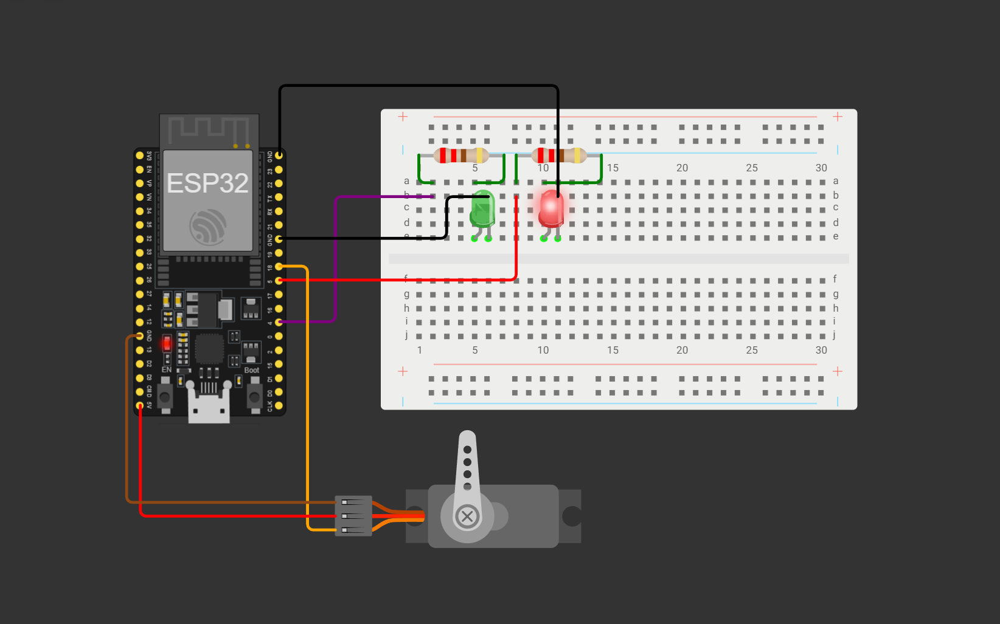
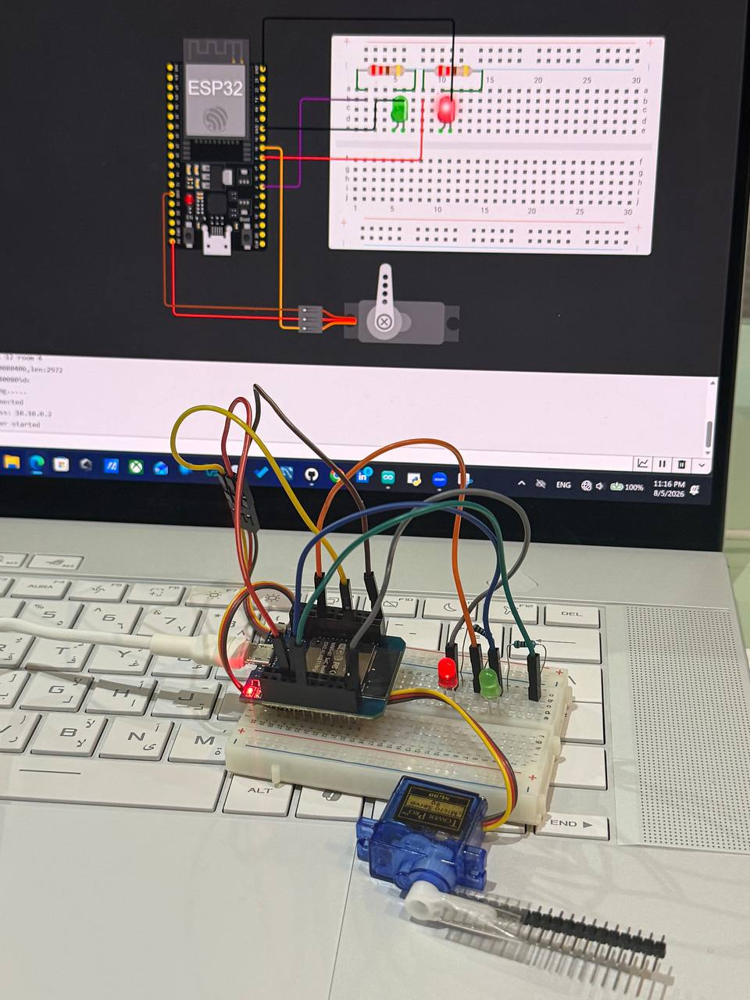

# ESP32 Smart Gate Control via Web Interface

A smart gate control system built using an ESP32, a servo motor, and two LEDs.  
The gate can be opened and closed through a simple web page hosted by the ESP32.

## Project Overview

The ESP32 works as a Wi-Fi Access Point and hosts a web interface with two buttons:

- **Open**
- **Close**

When the **Open** button is pressed:

- The servo motor moves to **90°**
- The green LED turns on
- The red LED turns off

When the **Close** button is pressed:

- The servo motor returns to **0°**
- The red LED turns on
- The green LED turns off

## Components

- ESP32
- Servo motor
- Green LED
- Red LED
- Two 220Ω resistors
- Breadboard
- Jumper wires

## Pin Connections

| Component | ESP32 Pin |
|---|---:|
| Green LED | GPIO 4 |
| Red LED | GPIO 5 |
| Servo Signal | GPIO 18 |
| Servo VCC | 5V |
| Ground | GND |

## Files

- `smart_gate_control.ino` — ESP32 source code
- `ESP32_Smart_Gate_Control.zip` — Wokwi project files
- `wokwi_circuit.png` — Wokwi circuit simulation
- `hardware_setup.jpg` — Physical hardware setup
- `demo.mp4` — Project demonstration

## Wokwi Simulation

Add your Wokwi project link here:

`https://wokwi.com/projects/PROJECT-ID`

## How to Use

1. Upload `smart_gate_control.ino` to the ESP32.
2. Connect to the Wi-Fi network:

   - Network name: `Aram-ESP32-Control`
   - Password: `12345678`

3. Open a web browser.
4. Enter:

   `192.168.4.1`

5. Use the **Open** and **Close** buttons to control the gate.

## Project Demonstration

### Wokwi Circuit

### Hardware Setup

### Demo Video

[Watch the demonstration video](demo.mp4)

## Technologies Used

- ESP32
- Arduino IDE
- C++
- HTML
- CSS
- Wi-Fi Access Point
- Web Server
- Wokwi Simulation

